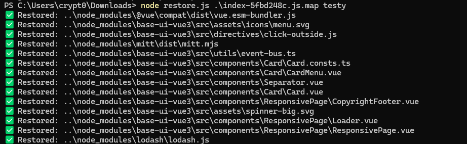

# restore-sourcemap

A simple CLI tool to extract original source files from a JavaScript source map (`.map`) file by restoring files from `sourcesContent`.  
This is useful for recovering original source code from bundled/minified JavaScript if the source map includes embedded source content.

---

## Features

- Restores original source files with directory structure based on the source map.
- Handles common source map path prefixes like `webpack:///`.
- Supports a flat output mode to dump all files into a single folder.
- Provides verbose and dry-run modes for debugging and preview.
- Works with any source map that includes `sourcesContent`.

---

## Requirements

- Node.js 12+ (should work with older versions as well)
- Source map file with embedded `sourcesContent`

---

## Usage

```bash
node restore.js <input.map> <output-folder> [--flat] [--verbose] [--dry-run]
```

Arguments
- <input.map> — path to your source map file (e.g., main.js.map)

- <output-folder> — folder to write restored files into (will be created if missing)

Options
--flat — ignore directory structure, dump all files into the output folder directly

--verbose — show detailed processing logs

--dry-run — simulate extraction without writing any files

# Example

```bash
node restore.js main.js.map ./restored-src --verbose
```

