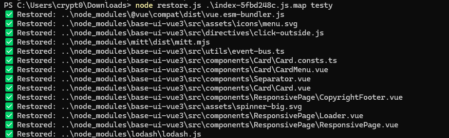

# restore-sourcemap

A simple CLI tool to extract original source files from a JavaScript source map (`.map`) file by restoring files from `sourcesContent`.
This is useful for recovering original source code from bundled/minified JavaScript if the source map includes embedded source content.

Available as both a Node.js script and a Go binary — same behavior, same flags, pick whichever fits your workflow.

Repo: [github.com/crypt0g30rgy/js-unpack](https://github.com/crypt0g30rgy/js-unpack)

---

## Features

- Restores original source files with directory structure based on the source map.
- Handles common source map path prefixes like `webpack:///`.
- Supports a flat output mode to dump all files into a single folder.
- Provides verbose and dry-run modes for debugging and preview.
- Works with any source map that includes `sourcesContent`.

---

## Requirements

- Node.js 12+ (should work with older versions as well) **or** Go 1.21+
- Source map file with embedded `sourcesContent`

---

## Usage

```bash
node restore.js <input.map|dir|glob> <output-folder> [--flat] [--verbose] [--dry-run] [--recursive]
```

```bash
restore-sourcemap <input.map|dir|glob> <output-folder> [--flat] [--verbose] [--dry-run] [--recursive]
```

Arguments
- `<input.map|dir|glob>` — a single `.map` file, a directory (all `*.map` files in it are processed), or a glob like `"./maps/*.map"` (simple `*` and `?` wildcards only — quote it so your shell doesn't expand it first)

- `<output-folder>` — folder to write restored files into (will be created if missing)

Options
`--flat` — ignore directory structure, dump all files into the output folder directly

`--verbose` — show detailed processing logs

`--dry-run` — simulate extraction without writing any files

`--recursive` — when the input is a directory (or glob base dir), descend into subdirectories too

# Example

```bash
node restore.js main.js.map ./restored-src --verbose
```

```bash
restore-sourcemap main.js.map ./restored-src --verbose
```



---

## Node.js install

No install step needed — just clone the repo and run the script directly with Node:

```bash
git clone https://github.com/crypt0g30rgy/js-unpack.git
cd js-unpack
node restore.js main.js.map ./restored-src --verbose
```

---

## Go install

The Go version lives at `cmd/restore-sourcemap` in this repo.

```bash
go install github.com/crypt0g30rgy/js-unpack/cmd@latest
```

This puts a `restore-sourcemap` binary in `$(go env GOPATH)/bin` (often `~/go/bin` — make sure that's on your `PATH`).

You can also install a specific tag once one exists, e.g. `@v0.1.0`, or build from a local clone:

```bash
git clone https://github.com/crypt0g30rgy/js-unpack.git
cd js-unpack
go build -o restore-sourcemap ./cmd/restore-sourcemap
./restore-sourcemap main.js.map ./restored-src --verbose
```

Exit codes: `1` bad args, `2` no `.map` files found, `5` one or more `.map` files were invalid/unparseable (other files are still processed).

---

## Docker

```bash
docker build -t restore-sourcemap .
```

```bash
docker run --rm \
  -v /path/on/host:/data \
  restore-sourcemap \
  /data/main.js.map /data/restored-src --verbose
```

### Explanation:

- `-v /path/on/host:/data` mounts the host directory to `/data` in the container

- The CLI arguments use `/data` paths so the container sees the files inside `/data`

- Restored files appear on your host machine under `/path/on/host/restored-src`

#### Notes

- Havent tested the docker way yet

- You can add `--flat` or `--dry-run` flags after output folder as usual.

- The container runs with no root privileges needed (default user is root inside container but it's isolated).

- Make sure you have read/write permissions on the mounted host directories.
